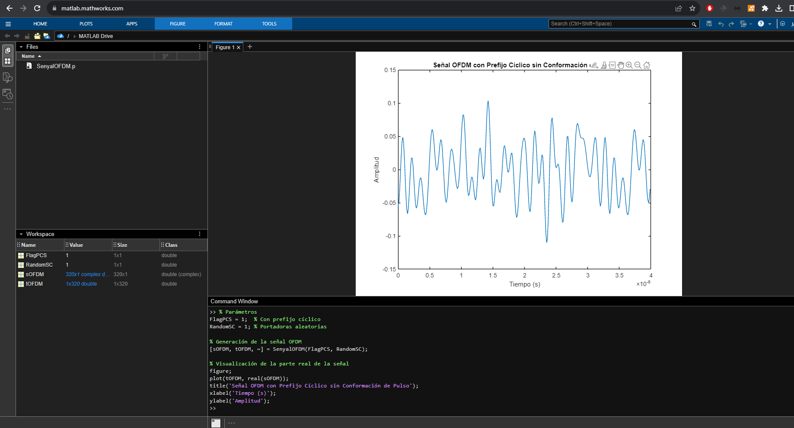
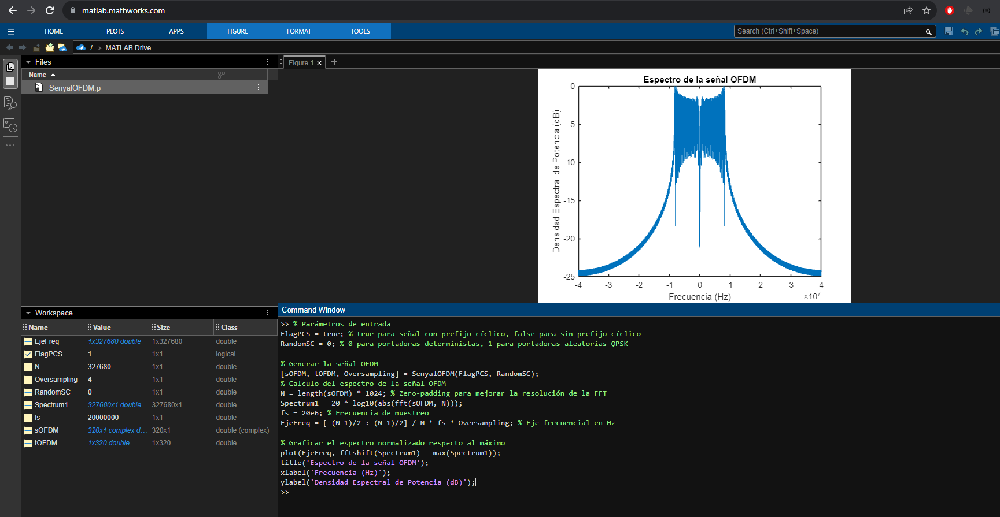
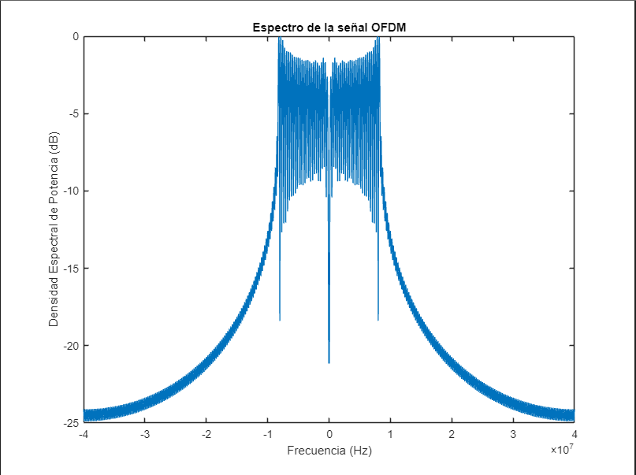
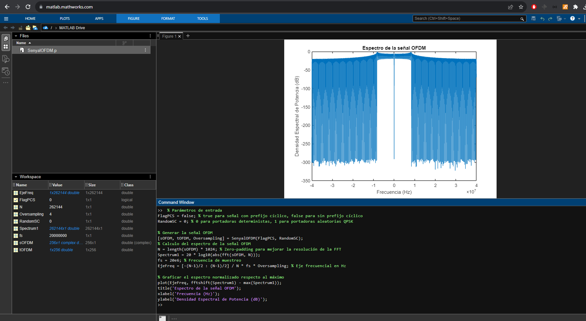
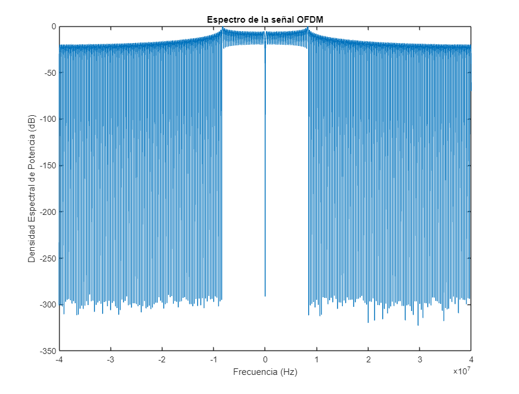

<head>
        <meta charset="UTF-8">
        <title>Master Universitario de Ingenier&iacute;a en Telecomunicaciones&period;</title>
        
        <link rel="stylesheet" href="https://cdn.jsdelivr.net/npm/katex/dist/katex.min.css">
<link href="https://cdn.jsdelivr.net/npm/katex-copytex@latest/dist/katex-copytex.min.css" rel="stylesheet" type="text/css">
        <link rel="stylesheet" href="https://cdn.jsdelivr.net/gh/Microsoft/vscode/extensions/markdown-language-features/media/markdown.css">
<link rel="stylesheet" href="https://cdn.jsdelivr.net/gh/Microsoft/vscode/extensions/markdown-language-features/media/highlight.css">

        

</head>

# Master Universitario de Ingeniería en Telecomunicaciones.

# 81.618 Codificaciones y modulaciones avanzadas - PEC2.

# José Enrique Rodríguez González.

## Presentación.

Esta PEC evalúa los conocimientos adquiridos sobre OFDM correspondientes al trabajo realizado en el módulo 5. Está estructurada en diferentes ejercicios destinados a evaluar que habéis entendido las principales ideas y conceptos que hay alrededor de la OFDM: cálculo del ancho de banda, velocidad de transmisión, tiempo de guarda, efecto de un canal y pérdida de eficiencia, así como mostrar una cierta madurez para trabajar con documentos que contienen información relacionada con OFDM.

---

## Competencias.

- Capacidad para construir, explotar y gestionar las redes, servicios, procesos y aplicaciones de telecomunicaciones, entendidas estas como sistemas de captación, transporte, representación, procesamiento, almacenamiento, gestión y presentación de información multimedia, desde el punto de vista de los sistemas de transmisión.

- Capacidad para aplicar las técnicas en que se basan las redes, servicios y aplicaciones de telecomunicación tanto en entornos fijos como móviles, personales, locales o a gran distancia, con diferentes anchos de banda, incluyendo telefonía, radiodifusión, televisión y datos, desde el punto de vista de los sistemas de transmisión.

- Capacidad para la selección de circuitos, subsistemas y sistemas de radiofrecuencia, microondas, radiodifusión, radioenlaces y radiolocalización.

- Capacidad para analizar, codificar, procesar y transmitir información multimedia empleando técnicas de procesado analógico y digital de señal.

---

      

## Objetivos.

- Evaluar la capacidad de trabajar con los parámetros que constituyen una señal OFDM (velocidad de transmisión, ancho de banda, duración del prefijo cíclico, tiempo de símbolo OFDM).

- Evaluar la capacidad de analizar el efecto de un canal dispersivo en tiempo sobre una señal OFDM y realizar cálculos de probabilidad de error para una señal OFDM.

- Evaluar la capacidad de comparar un sistema OFDM con uno de portadora única.

---

## Descripción de la PEC.

Esta PEC sólo evalúa uno de los módulos de la asignatura y el tiempo para realizarla es reducido (en comparación a las otras dos PECs del curso). Por esta razón tenéis una PEC corta que busca directamente evaluar conocimientos concretos. Algunas cuestiones de la PEC las podréis resolver en paralelo con el estudio del módulo motivo por el que disponéis del enunciado al inicio del estudio del mismo. Se recomienda que el trabajo del módulo lo llevéis al día ya que se ha previsto la entrega una semana después de haber terminado el módulo (veréis que dada la brevedad de la PEC es tiempo suficiente si se han entendido los conceptos trabajados en el módulo).

---

## Recursos.

**Recursos Básicos**

- Guía de estudio del módulo 5.

- Materiales didácticos: Módulo 5.

---

## Recursos Complementarios.

- Bibliografía básica y complementaria referenciada en los materiales didácticos.
- MATLAB para la parte opcional (consultad el fichero Matlab.pdf del aula para su instalación).

---

        

## Criterios de valoración.

Las respuestas tienen que estar debidamente justificadas y sólo se valorarán las respuestas que se hayan justificado correctamente. La resolución de la cuarta parte, correspondiente a un ejercicio práctico, es opcional. El objetivo es que podáis profundizar en los aspectos de OFDM, y en concreto en el conocimiento de su espectro. Los alumnos que realicen la parte práctica tienen que saber que se evaluará y se tendrá en cuenta favorablemente al final de curso para redondear la nota final del EC (siempre al alza). Como se comenta en la descripción de esa parte, no se evaluará la práctica si os limitáis a adjuntar capturas de pantalla sin comentarios o con comentarios muy escuetos que no demuestren que habéis trabajado y entendido los resultados.

---

## Formato y fecha de entrega.

Se tiene que **entregar la PEC** en el aula a través de la tarea creada para esta finalidad.

Preferiblemente entregad el documento en PDF y comprobad que todas las ecuaciones se ven correctamente. Es posible incluir imágenes escaneadas de documentos elaborados a mano. En este caso, intentad cuidar al máximo la letra y la organización del documento. Si se desea se puede entregar en PDF y en formato Office. Se recomienda no realizar la entrega sólo en formato Word puesto que no siempre las fórmulas se mantienen en todas las versiones.

**Las páginas tienen que estar numeradas y vuestro nombre y apellidos también tiene que aparecer en la parte superior de cada una de las páginas del documento.**

---

           

## Índice

- [Enunciado](#enunciado)
- [Parte 1.](#parte-1-parámetros-de-la-señal-ofdm)
- [Pregunta 1.1.](#pregunta-11)
- [Respuesta a la pregunta 1.1.](#respuesta-a-la-pregunta-11)
- [Pregunta 1.2.](#pregunta-12)
- [Respuesta a la pregunta 1.2.](#respuesta-a-la-pregunta-12)
- [Pregunta 1.3.](#pregunta-13)
- [Respuesta a la pregunta 1.3.](#respuesta-a-la-pregunta-13)
- [Parte 2. Canal de comunicaciones.](#parte-2-canal-de-comunicaciones)
- [Pregunta 2.1.](#pregunta-21)
- [Respuesta a la pregunta 2.1.](#respuesta-a-la-pregunta-21)
- [Pregunta 2.2.](#pregunta-22)
- [Respuesta a la pregunta 2.2.](#respuesta-a-la-pregunta-22)
- [Información adicional 2.3.](#información-adicional-23)
- [Pregunta 2.3.1.](#pregunta-231)
- [Respuesta a la pregunta 2.3.1.](#respuesta-a-la-pregunta-231)
- [Pregunta 2.3.2.](#pregunta-232)
- [Respuesta a la pregunta 2.3.2.](#respuesta-a-la-pregunta-232)
- [Parte 3. Reflexiones sobre OFDM.](#parte-3-reflexiones-sobre-ofdm)
- [Pregunta 3.1.](#pregunta-31)
- [Respuesta a la pregunta 3.1.](#respuesta-a-la-pregunta-31)
- [Pregunta 3.2.](#pregunta-32)
- [Respuesta a la pregunta 3.2.](#respuesta-a-la-pregunta-32)
- [Pregunta 3.3.](#pregunta-33)
- [Respuesta a la pregunta 3.3.](#respuesta-a-la-pregunta-33)
- [Parte 4. Práctica con MATLAB (opcional).](#parte-4-práctica-con-matlab-opcional)
- [Pregunta 4.1.](#pregunta-41)
- [Respuesta a la pregunta 4.1.](#respuesta-a-la-pregunta-41)
- [Pregunta 4.2.](#pregunta-42)
- [Respuesta a la pregunta 4.2.](#respuesta-a-la-pregunta-42)

---

            

## Enunciado.

En la PEC anterior trabajamos, de manera simplificada, la codificación de una señal obtenida a partir de una red de sensores y se evaluaron los esquemas de codificación de canal y de fuente con información extraída de un estándar de comunicación que estandariza la transmisión de este tipo de señales. Siguiendo con información extraída del mismo estándar, en esta PEC propondremos la transmisión de aquella señal haciendo uso de un esquema de modulación OFDM. El objetivo de la PEC será plantear preguntas relacionadas con la capa física de un sistema de comunicación real que emplea la modulación OFDM trabajada en el módulo 5 del curso.

Las tres primeras partes de la PEC, de resolución obligatoria, harán referencia al cálculo de parámetros de la capa física de la señal, a las características de su canal de comunicaciones, y a preguntas genéricas con objeto de poder demostrar una cierta madurez sobre los conocimientos del módulo. La cuarta parte de la PEC propondrá una práctica (de trabajo opcional) que se basará en el uso de MATLAB con objeto de entender mejor la estructura y funcionamiento de las técnicas de comunicación basadas en OFDM.

[Volver al Índice](#índice)

---

## Parte 1. Parámetros de la señal OFDM.

Se pide que, con la información que encontraréis en las tablas adjuntas, realicéis algunos cálculos relacionados con los parámetros de la señal OFDM (**en la solución de la PEC se tienen que entregar todos los pasos comentados necesarios para obtener los resultados que se piden**).

[Volver al Índice](#índice)

---

                

## Pregunta 1.1.

- La primera tabla hace referencia a los parámetros de la señal OFDM. Calculad (incluyendo los cálculos realizados) los valores de los espacios en blanco.

<table>
<thead>
<tr>
<th style="text-align:center"><math xmlns="http://www.w3.org/1998/Math/MathML"><semantics><mrow><mi>N</mi></mrow><annotation encoding="application/x-tex">N</annotation></semantics></math>N</th>
<th style="text-align:center"><math xmlns="http://www.w3.org/1998/Math/MathML"><semantics><mrow><mi>K</mi></mrow><annotation encoding="application/x-tex">K</annotation></semantics></math>K</th>
<th style="text-align:center"><math xmlns="http://www.w3.org/1998/Math/MathML"><semantics><mrow><msub><mi>K</mi><mi>U</mi></msub></mrow><annotation encoding="application/x-tex">K_U</annotation></semantics></math>KU​</th>
<th style="text-align:center"><math xmlns="http://www.w3.org/1998/Math/MathML"><semantics><mrow><msub><mi>δ</mi><mi>f</mi></msub></mrow><annotation encoding="application/x-tex">\delta_f</annotation></semantics></math>δf​</th>
<th style="text-align:center"><math xmlns="http://www.w3.org/1998/Math/MathML"><semantics><mrow><msub><mi>T</mi><mi>p</mi></msub></mrow><annotation encoding="application/x-tex">T_p</annotation></semantics></math>Tp​</th>
<th style="text-align:center"><math xmlns="http://www.w3.org/1998/Math/MathML"><semantics><mrow><msub><mi>T</mi><mi>G</mi></msub></mrow><annotation encoding="application/x-tex">T_G</annotation></semantics></math>TG​</th>
<th style="text-align:center"><math xmlns="http://www.w3.org/1998/Math/MathML"><semantics><mrow><msub><mi>T</mi><mrow><mi>O</mi><mi>F</mi><mi>D</mi><mi>M</mi></mrow></msub></mrow><annotation encoding="application/x-tex">T_{OFDM}</annotation></semantics></math>TOFDM​</th>
<th style="text-align:center"><math xmlns="http://www.w3.org/1998/Math/MathML"><semantics><mrow><msub><mi>B</mi><msub><mi>W</mi><mrow><mi>O</mi><mi>F</mi><mi>D</mi><mi>M</mi></mrow></msub></msub></mrow><annotation encoding="application/x-tex">B_{W_{OFDM}}</annotation></semantics></math>BWOFDM​​</th>
</tr>
</thead>
<tbody>
<tr>
<td style="text-align:center">128</td>
<td style="text-align:center">104</td>
<td style="text-align:center">96</td>
<td style="text-align:center"></td>
<td style="text-align:center">96 <math xmlns="http://www.w3.org/1998/Math/MathML"><semantics><mrow><mi>μ</mi><mi>s</mi></mrow><annotation encoding="application/x-tex">\mu s</annotation></semantics></math>μs</td>
<td style="text-align:center"></td>
<td style="text-align:center">120 <math xmlns="http://www.w3.org/1998/Math/MathML"><semantics><mrow><mi>μ</mi><mi>s</mi></mrow><annotation encoding="application/x-tex">\mu s</annotation></semantics></math>μs</td>
<td style="text-align:center"></td>
</tr>
<tr>
<td style="text-align:center"></td>
<td style="text-align:center"></td>
<td style="text-align:center"></td>
<td style="text-align:center"></td>
<td style="text-align:center"></td>
<td style="text-align:center"></td>
<td style="text-align:center"></td>
<td style="text-align:center"></td>
</tr>
</tbody>
</table>

Donde:

- <math xmlns="http://www.w3.org/1998/Math/MathML"><semantics><mrow><mi>N</mi></mrow><annotation encoding="application/x-tex">N</annotation></semantics></math>N: Número de puntos de la FFT (potencia de 2).
- <math xmlns="http://www.w3.org/1998/Math/MathML"><semantics><mrow><mi>K</mi></mrow><annotation encoding="application/x-tex">K</annotation></semantics></math>K: Número de portadoras no suprimidas.
- <math xmlns="http://www.w3.org/1998/Math/MathML"><semantics><mrow><msub><mi>K</mi><mi>U</mi></msub></mrow><annotation encoding="application/x-tex">K_U</annotation></semantics></math>KU​: Número de portadoras útiles (sin considerar los tonos piloto).
- <math xmlns="http://www.w3.org/1998/Math/MathML"><semantics><mrow><msub><mi>δ</mi><mi>f</mi></msub></mrow><annotation encoding="application/x-tex">\delta_f</annotation></semantics></math>δf​: Separación en frecuencia entre portadoras consecutivas.
- <math xmlns="http://www.w3.org/1998/Math/MathML"><semantics><mrow><msub><mi>T</mi><mi>p</mi></msub></mrow><annotation encoding="application/x-tex">T_p</annotation></semantics></math>Tp​: Tiempo útil de símbolo.
- <math xmlns="http://www.w3.org/1998/Math/MathML"><semantics><mrow><msub><mi>T</mi><mi>G</mi></msub></mrow><annotation encoding="application/x-tex">T_G</annotation></semantics></math>TG​: Tiempo de prefijo cíclico.
- <math xmlns="http://www.w3.org/1998/Math/MathML"><semantics><mrow><msub><mi>T</mi><mrow><mi>O</mi><mi>F</mi><mi>D</mi><mi>M</mi></mrow></msub></mrow><annotation encoding="application/x-tex">T_{OFDM}</annotation></semantics></math>TOFDM​: Tiempo de símbolo OFDM.
- <math xmlns="http://www.w3.org/1998/Math/MathML"><semantics><mrow><msub><mi>B</mi><msub><mi>W</mi><mrow><mi>O</mi><mi>F</mi><mi>D</mi><mi>M</mi></mrow></msub></msub></mrow><annotation encoding="application/x-tex">B_{W_{OFDM}}</annotation></semantics></math>BWOFDM​​: Ancho de banda de la señal OFDM.

[Volver al Índice](#índice)

---

                        

## Respuesta a la pregunta 1.1.

Para resolver la [Pregunta 1.1](#pregunta-11), usaremos los parámetros dados en la tabla y las fórmulas asociadas con la señal OFDM.

1. <math xmlns="http://www.w3.org/1998/Math/MathML"><semantics><mrow><msub><mi>δ</mi><mi>f</mi></msub></mrow><annotation encoding="application/x-tex">\delta_f</annotation></semantics></math>δf​ (Separación en frecuencia entre portadoras consecutivas):
    - Se calcula como <math xmlns="http://www.w3.org/1998/Math/MathML"><semantics><mrow><msub><mi>δ</mi><mi>f</mi></msub><mo>=</mo><mn>1</mn><mi mathvariant="normal">/</mi><msub><mi>T</mi><mi>p</mi></msub></mrow><annotation encoding="application/x-tex">\delta_f = 1 / T_p</annotation></semantics></math>δf​=1/Tp​.
    - Con <math xmlns="http://www.w3.org/1998/Math/MathML"><semantics><mrow><msub><mi>T</mi><mi>p</mi></msub><mo>=</mo><mn>96</mn><mo separator="true">,</mo><mi>μ</mi><mi>s</mi></mrow><annotation encoding="application/x-tex">T_p = 96, \mu s</annotation></semantics></math>Tp​=96,μs, <math xmlns="http://www.w3.org/1998/Math/MathML"><semantics><mrow><msub><mi>δ</mi><mi>f</mi></msub><mo>=</mo><mn>1</mn><mi mathvariant="normal">/</mi><mo stretchy="false">(</mo><mn>96</mn><mo>×</mo><mn>1</mn><msup><mn>0</mn><mrow><mo>−</mo><mn>6</mn></mrow></msup><mo stretchy="false">)</mo></mrow><annotation encoding="application/x-tex">\delta_f = 1 / (96 \times 10^{-6})</annotation></semantics></math>δf​=1/(96×10−6) Hz.
2. <math xmlns="http://www.w3.org/1998/Math/MathML"><semantics><mrow><msub><mi>T</mi><mi>G</mi></msub></mrow><annotation encoding="application/x-tex">T_G</annotation></semantics></math>TG​ (Tiempo de prefijo cíclico):
    - Dado que <math xmlns="http://www.w3.org/1998/Math/MathML"><semantics><mrow><msub><mi>T</mi><mrow><mi>O</mi><mi>F</mi><mi>D</mi><mi>M</mi></mrow></msub><mo>=</mo><msub><mi>T</mi><mi>p</mi></msub><mo>+</mo><msub><mi>T</mi><mi>G</mi></msub></mrow><annotation encoding="application/x-tex">T_{OFDM} = T_p + T_G</annotation></semantics></math>TOFDM​=Tp​+TG​, podemos reorganizar para <math xmlns="http://www.w3.org/1998/Math/MathML"><semantics><mrow><msub><mi>T</mi><mi>G</mi></msub><mo>=</mo><msub><mi>T</mi><mrow><mi>O</mi><mi>F</mi><mi>D</mi><mi>M</mi></mrow></msub><mo>−</mo><msub><mi>T</mi><mi>p</mi></msub></mrow><annotation encoding="application/x-tex">T_G = T_{OFDM} - T_p</annotation></semantics></math>TG​=TOFDM​−Tp​.
    - Con <math xmlns="http://www.w3.org/1998/Math/MathML"><semantics><mrow><msub><mi>T</mi><mrow><mi>O</mi><mi>F</mi><mi>D</mi><mi>M</mi></mrow></msub><mo>=</mo><mn>120</mn><mo separator="true">,</mo><mi>μ</mi><mi>s</mi></mrow><annotation encoding="application/x-tex">T_{OFDM} = 120, \mu s</annotation></semantics></math>TOFDM​=120,μs y <math xmlns="http://www.w3.org/1998/Math/MathML"><semantics><mrow><msub><mi>T</mi><mi>p</mi></msub><mo>=</mo><mn>96</mn><mo separator="true">,</mo><mi>μ</mi><mi>s</mi></mrow><annotation encoding="application/x-tex">T_p = 96, \mu s</annotation></semantics></math>Tp​=96,μs, <math xmlns="http://www.w3.org/1998/Math/MathML"><semantics><mrow><msub><mi>T</mi><mi>G</mi></msub><mo>=</mo><mn>120</mn><mo separator="true">,</mo><mi>μ</mi><mi>s</mi><mo>−</mo><mn>96</mn><mo separator="true">,</mo><mi>μ</mi><mi>s</mi></mrow><annotation encoding="application/x-tex">T_G = 120, \mu s - 96, \mu s</annotation></semantics></math>TG​=120,μs−96,μs.
3. <math xmlns="http://www.w3.org/1998/Math/MathML"><semantics><mrow><msub><mi>B</mi><msub><mi>W</mi><mrow><mi>O</mi><mi>F</mi><mi>D</mi><mi>M</mi></mrow></msub></msub></mrow><annotation encoding="application/x-tex">B_{W_{OFDM}}</annotation></semantics></math>BWOFDM​​ (Ancho de banda de la señal OFDM):
    - El ancho de banda se calcula como <math xmlns="http://www.w3.org/1998/Math/MathML"><semantics><mrow><msub><mi>B</mi><msub><mi>W</mi><mrow><mi>O</mi><mi>F</mi><mi>D</mi><mi>M</mi></mrow></msub></msub><mo>=</mo><mi>K</mi><mo>⋅</mo><msub><mi>δ</mi><mi>f</mi></msub></mrow><annotation encoding="application/x-tex">B_{W_{OFDM}} = K \cdot \delta_f</annotation></semantics></math>BWOFDM​​=K⋅δf​.
    - Con <math xmlns="http://www.w3.org/1998/Math/MathML"><semantics><mrow><mi>K</mi><mo>=</mo><mn>104</mn></mrow><annotation encoding="application/x-tex">K = 104</annotation></semantics></math>K=104 y <math xmlns="http://www.w3.org/1998/Math/MathML"><semantics><mrow><msub><mi>δ</mi><mi>f</mi></msub></mrow><annotation encoding="application/x-tex">\delta_f</annotation></semantics></math>δf​ calculado anteriormente, <math xmlns="http://www.w3.org/1998/Math/MathML"><semantics><mrow><msub><mi>B</mi><msub><mi>W</mi><mrow><mi>O</mi><mi>F</mi><mi>D</mi><mi>M</mi></mrow></msub></msub><mo>=</mo><mn>104</mn><mo>⋅</mo><msub><mi>δ</mi><mi>f</mi></msub></mrow><annotation encoding="application/x-tex">B_{W_{OFDM}} = 104 \cdot \delta_f</annotation></semantics></math>BWOFDM​​=104⋅δf​.

Con el siguiente script en python, procederemos a realizar los cálculos para obtener los valores exactos:

~~~Python
# Definiendo los parámetros dados
T_p_micros = 96  # Tiempo útil de símbolo en microsegundos
T_OFDM_micros = 120  # Tiempo de símbolo OFDM en microsegundos
K = 104  # Número de portadoras no suprimidas

# Convertir tiempos a segundos
T_p = T_p_micros * 10**-6
T_OFDM = T_OFDM_micros * 10**-6

# Cálculo de la separación en frecuencia entre portadoras consecutivas (delta_f)
delta_f = 1 / T_p

# Cálculo del tiempo de prefijo cíclico (T_G)
T_G = T_OFDM - T_p

# Cálculo del ancho de banda de la señal OFDM (B_W_OFDM)
B_W_OFDM = K * delta_f

print("delta_f: ", delta_f, " Hz")
print("T_G: ", T_G, " s")
print("B_W_OFDM: ", B_W_OFDM, " Hz")
~~~

Obteniendo la siguiente respuesta por parte de la consola:

~~~Shell
delta_f:  10416.666666666666  Hz
T_G:  2.3999999999999987e-05  s
B_W_OFDM:  1083333.3333333333  Hz
~~~

 

**Conclusiones:**

- <math xmlns="http://www.w3.org/1998/Math/MathML"><semantics><mrow><msub><mi>δ</mi><mi>f</mi></msub></mrow><annotation encoding="application/x-tex">\delta_f</annotation></semantics></math>δf​ (Separación en frecuencia entre portadoras consecutivas): <math xmlns="http://www.w3.org/1998/Math/MathML"><semantics><mrow><mn>10416.67</mn><mi>H</mi><mi>z</mi></mrow><annotation encoding="application/x-tex">10416.67 Hz</annotation></semantics></math>10416.67Hz.

- <math xmlns="http://www.w3.org/1998/Math/MathML"><semantics><mrow><msub><mi>T</mi><mi>G</mi></msub></mrow><annotation encoding="application/x-tex">T_G</annotation></semantics></math>TG​ (Tiempo de prefijo cíclico)<math xmlns="http://www.w3.org/1998/Math/MathML"><semantics><mrow><mo>≈</mo><mn>24</mn><mtext>µ</mtext><mi>s</mi></mrow><annotation encoding="application/x-tex">\approx 24 µs</annotation></semantics></math>≈24µs.

- <math xmlns="http://www.w3.org/1998/Math/MathML"><semantics><mrow><msub><mi>B</mi><msub><mi>W</mi><mrow><mi>O</mi><mi>F</mi><mi>D</mi><mi>M</mi></mrow></msub></msub></mrow><annotation encoding="application/x-tex">B_{W_{OFDM}}</annotation></semantics></math>BWOFDM​​ (Ancho de banda de la señal OFDM) <math xmlns="http://www.w3.org/1998/Math/MathML"><semantics><mrow><mo>=</mo><mn>1</mn><mo separator="true">,</mo><mn>083</mn><mo separator="true">,</mo><mn>333.33</mn><mi>H</mi><mi>z</mi><mo>≈</mo><mn>1.08</mn><mi>M</mi><mi>H</mi><mi>z</mi></mrow><annotation encoding="application/x-tex">= 1,083,333.33 Hz \approx 1.08 MHz</annotation></semantics></math>=1,083,333.33Hz≈1.08MHz.

[Volver al Índice](#índice)

---

## Pregunta 1.2.

¿En qué factor se ve reducida la velocidad de transmisión debido a la inserción del prefijo cíclico?

[Volver al Índice](#índice)

---

                              

## Respuesta a la pregunta 1.2.

Para determinar el factor por el cual se reduce la velocidad de transmisión debido a la inserción del prefijo cíclico en una señal OFDM, se compara el tiempo total de símbolo OFDM (<math xmlns="http://www.w3.org/1998/Math/MathML"><semantics><mrow><msub><mi>T</mi><mrow><mi>O</mi><mi>F</mi><mi>D</mi><mi>M</mi></mrow></msub></mrow><annotation encoding="application/x-tex">T_{OFDM}</annotation></semantics></math>TOFDM​) con el tiempo útil de símbolo (<math xmlns="http://www.w3.org/1998/Math/MathML"><semantics><mrow><msub><mi>T</mi><mi>p</mi></msub></mrow><annotation encoding="application/x-tex">T_p</annotation></semantics></math>Tp​).

El factor de reducción se calcula como la relación entre el tiempo de símbolo OFDM y el tiempo útil de símbolo. Esto es:

Factor de reducción <math xmlns="http://www.w3.org/1998/Math/MathML"><semantics><mrow><mo>=</mo><mfrac><msub><mi>T</mi><mrow><mi>O</mi><mi>F</mi><mi>D</mi><mi>M</mi></mrow></msub><msub><mi>T</mi><mi>p</mi></msub></mfrac></mrow><annotation encoding="application/x-tex">= \frac{T_{OFDM}}{T_p}</annotation></semantics></math>=Tp​TOFDM​​.

Ya tenemos los valores de <math xmlns="http://www.w3.org/1998/Math/MathML"><semantics><mrow><msub><mi>T</mi><mrow><mi>O</mi><mi>F</mi><mi>D</mi><mi>M</mi></mrow></msub></mrow><annotation encoding="application/x-tex">T_{OFDM}</annotation></semantics></math>TOFDM​ y <math xmlns="http://www.w3.org/1998/Math/MathML"><semantics><mrow><msub><mi>T</mi><mi>p</mi></msub></mrow><annotation encoding="application/x-tex">T_p</annotation></semantics></math>Tp​ de la pregunta anterior. Realizaremos los cálculos con según el siguiente script de python, siendo este continuación del código anterior.

~~~Python
# Cálculo del factor de reducción debido al prefijo cíclico
factor_reduccion = T_p / T_OFDM
print("factor_reduccion: ", factor_reduccion)
~~~

Obteniendo la siguiente respuesta por parte de la consola:

~~~Shell
factor_reduccion:  0.8
~~~

**Conclusiones:**

El factor por el cual se reduce la velocidad de transmisión debido a la inserción del prefijo cíclico es de 0.8 o el 80%. Esto significa que, debido al tiempo adicional ocupado por el prefijo cíclico, solo el 80% del tiempo del símbolo OFDM se utiliza para la transmisión efectiva de datos.

[Volver al Índice](#índice)

---

              

## Pregunta 1.3.

Teniendo en cuenta el número de portadoras útiles indicadas en la tabla 1, un prefijo cíclico de duración 1/4 del tiempo útil de símbolo, y sabiendo que los datos son codificados mediante un código convolucional de rate k/n (que puede ser variable) determinad, para el caso 1, la velocidad de transmisión en símbolos por segundo, en bits por segundo codificados y en bits por segundo útiles para los diferentes casos de modulación y rate del código convolucional indicados a la tabla 2.

Para el caso 2, proponed una modulación y un código que pueda lograr la velocidad de transmisión de 300 kb/s.

<table>
<thead>
<tr>
<th style="text-align:center">Modo</th>
<th style="text-align:center">Modulación</th>
<th style="text-align:center">Rate código convolucional</th>
<th style="text-align:center">V. tx. símbolo (símbolos/s.)</th>
<th style="text-align:center">V. tx. bits codificados (kb/s)</th>
<th style="text-align:center">V. tx. bits útiles</th>
</tr>
</thead>
<tbody>
<tr>
<td style="text-align:center">Caso 1</td>
<td style="text-align:center">QPSK</td>
<td style="text-align:center">1/2</td>
<td style="text-align:center"></td>
<td style="text-align:center"></td>
<td style="text-align:center"></td>
</tr>
<tr>
<td style="text-align:center">Caso 2</td>
<td style="text-align:center"></td>
<td style="text-align:center"></td>
<td style="text-align:center"></td>
<td style="text-align:center"></td>
<td style="text-align:center">300</td>
</tr>
<tr>
<td style="text-align:center"></td>
<td style="text-align:center"></td>
<td style="text-align:center"></td>
<td style="text-align:center"></td>
<td style="text-align:center"></td>
<td style="text-align:center"></td>
</tr>
</tbody>
</table>

[Volver al Índice](#índice)

---

                      

## Respuesta a la pregunta 1.3.

Para resolver la Pregunta 1.3, aplicaremos los conceptos de modulación y codificación en la señal OFDM.

**Caso 1: QPSK con Rate de Código Convencional 1/2**

1. Velocidad de Transmisión en Símbolos por Segundo (V. tx. símbolo):
    - Se calcula como el inverso del tiempo de símbolo OFDM: <math xmlns="http://www.w3.org/1998/Math/MathML"><semantics><mrow><mi>V</mi><mi mathvariant="normal">.</mi><mi>t</mi><mi>x</mi><mi mathvariant="normal">.</mi><mi>s</mi><mover accent="true"><mi mathvariant="normal">ı</mi><mo>ˊ</mo></mover><mi>m</mi><mi>b</mi><mi>o</mi><mi>l</mi><mi>o</mi><mo>=</mo><mn>1</mn><mi mathvariant="normal">/</mi><msub><mi>T</mi><mrow><mi>O</mi><mi>F</mi><mi>D</mi><mi>M</mi></mrow></msub></mrow><annotation encoding="application/x-tex">V.tx.símbolo = 1/T_{OFDM}</annotation></semantics></math>V.tx.sıˊmbolo=1/TOFDM​.
2. Velocidad de Transmisión en Bits por Segundo Codificados (V. tx. bits codificados):
    - Para QPSK, cada símbolo lleva 2 bits. Entonces, <math xmlns="http://www.w3.org/1998/Math/MathML"><semantics><mrow><mtext>V.tx.bitscodificados</mtext><mo>=</mo><mrow><mtext>V.tx.s</mtext><mover accent="true"><mtext>ı</mtext><mo>ˊ</mo></mover><mtext>mbolo</mtext></mrow><mo>×</mo><mn>2</mn><mo>×</mo><msub><mi>K</mi><mi>U</mi></msub></mrow><annotation encoding="application/x-tex">\text{V.tx.bitscodificados}=\text{V.tx.símbolo} \times 2 \times K_U</annotation></semantics></math>V.tx.bitscodificados=V.tx.sıˊmbolo×2×KU​.
3. Velocidad de Transmisión en Bits por Segundo Útiles (V. tx. bits útiles):
    - Con un rate de código convencional de 1/2, la mitad de los bits son para redundancia. Entonces, <math xmlns="http://www.w3.org/1998/Math/MathML"><semantics><mrow><mrow><mtext>V.tx.bits</mtext><mover accent="true"><mtext>u</mtext><mo>ˊ</mo></mover><mtext>tiles</mtext></mrow><mo>=</mo><mtext>V.tx.bitscodificados</mtext><mo>×</mo><mtext>rate</mtext></mrow><annotation encoding="application/x-tex">\text{V.tx.bitsútiles} = \text{V.tx.bitscodificados} \times \text{rate}</annotation></semantics></math>V.tx.bitsuˊtiles=V.tx.bitscodificados×rate.

Procedemos a realizar los cálculos con el siguiente script de python, el cual es continuación del presente ejercicio.

~~~Python
# Parámetros dados para el Caso 1
K_U = 96  # Número de portadoras útiles
rate_codigo = 1/2  # Rate del código convencional
bits_por_simbolo_QPSK = 2  # Cada símbolo QPSK lleva 2 bits

# Cálculo para el Caso 1
# Velocidad de transmisión en símbolos por segundo
velocidad_simbolos_s = 1 / T_OFDM

# Velocidad de transmisión en bits por segundo codificados
velocidad_bits_codificados_s = velocidad_simbolos_s * bits_por_simbolo_QPSK * K_U

# Velocidad de transmisión en bits por segundo útiles
velocidad_bits_utiles_s = velocidad_bits_codificados_s * rate_codigo

print("Caso 1:")
print("Velocidad de transmisión en símbolos por segundo: ", velocidad_simbolos_s, " símbolo/s.")
print("Velocidad de transmisión en bits por segundo codificados: ", velocidad_bits_codificados_s / 1000, " kb/s.")
print("Velocidad de transmisión en bits por segundo útiles: ", velocidad_bits_utiles_s / 1000, " kb/s.")
~~~

Obtenemos la siguiente respuesta de la consola

~~~Shell
Caso 1:
Velocidad de transmisión en símbolos por segundo:  8333.333333333334  símbolo/s.
Velocidad de transmisión en bits por segundo codificados:  1600.0  kb/s.
Velocidad de transmisión en bits por segundo útiles:  800.0  kb/s.
~~~

**Respuesta para el caso 1:**

- Velocidad de Transmisión en Símbolos por Segundo (V. tx. símbolo): <math xmlns="http://www.w3.org/1998/Math/MathML"><semantics><mrow><mn>8333.333333333334</mn><mi>s</mi><mover accent="true"><mi mathvariant="normal">ı</mi><mo>ˊ</mo></mover><mi>m</mi><mi>b</mi><mi>o</mi><mi>l</mi><mi>o</mi><mi mathvariant="normal">/</mi><mi>s</mi></mrow><annotation encoding="application/x-tex">8333.333333333334  símbolo/s</annotation></semantics></math>8333.333333333334sıˊmbolo/s.
- Velocidad de Transmisión en Bits por Segundo Codificados (V. tx. bits codificados):<math xmlns="http://www.w3.org/1998/Math/MathML"><semantics><mrow><mn>1600.0</mn><mi>k</mi><mi>b</mi><mi mathvariant="normal">/</mi><mi>s</mi></mrow><annotation encoding="application/x-tex">1600.0  kb/s</annotation></semantics></math>1600.0kb/s.
- Velocidad de Transmisión en Bits por Segundo Útiles (V. tx. bits útiles): <math xmlns="http://www.w3.org/1998/Math/MathML"><semantics><mrow><mn>800.0</mn><mi>k</mi><mi>b</mi><mi mathvariant="normal">/</mi><mi>s</mi></mrow><annotation encoding="application/x-tex">800.0  kb/s</annotation></semantics></math>800.0kb/s.

**Propuesta para el Caso 2 (Alcanzar una Velocidad de Transmisión de 300 kb/s)**

Para alcanzar una velocidad útil de transmisión de 300 kb/s, se puede jugar con la modulación y el rate del código convolucional. Una estrategia podría ser usar una modulación con menos bits por símbolo y/o un rate de código más alto. Por ejemplo, podríamos considerar usar BPSK (1 bit por símbolo) con un rate de código de 1/2.

La fórmula para la velocidad de bits útiles sería entonces:

<math xmlns="http://www.w3.org/1998/Math/MathML"><semantics><mrow><mrow><mtext>V.tx.bits </mtext><mover accent="true"><mtext>u</mtext><mo>ˊ</mo></mover><mtext>tiles</mtext></mrow><mo>=</mo><mfrac><mn>1</mn><msub><mi>T</mi><mrow><mi>O</mi><mi>F</mi><mi>D</mi><mi>M</mi></mrow></msub></mfrac><mo>×</mo><mrow><mtext>bits por s</mtext><mover accent="true"><mtext>ı</mtext><mo>ˊ</mo></mover><mtext>mbolo de BPSK</mtext></mrow><mo>×</mo><msub><mi>K</mi><mi>U</mi></msub><mo>×</mo><mrow><mtext>rate del c</mtext><mover accent="true"><mtext>o</mtext><mo>ˊ</mo></mover><mtext>digo</mtext></mrow></mrow><annotation encoding="application/x-tex">\text{V.tx.bits útiles} = \frac{1}{T_{OFDM}} \times \text{bits por símbolo de BPSK} \times K_U \times \text{rate del código}</annotation></semantics></math>V.tx.bits uˊtiles=TOFDM​1​×bits por sıˊmbolo de BPSK×KU​×rate del coˊdigo

Procederemos a probar a realizar los cálculos con la combinación de BPSK con un rate de código de 1/2, resultando los siguientes cálculos.

~~~Python
# Parámetros para el Caso 2
# Considerando BPSK con 1 bit por símbolo y un rate de código de 1/2
bits_por_simbolo_BPSK = 1  # Cada símbolo BPSK lleva 1 bit
rate_codigo_BPSK = 1/2  # Rate del código convencional para BPSK
# Cálculo de la velocidad de bits útiles para BPSK
velocidad_bits_utiles_BPSK_s = (1 / T_OFDM) * bits_por_simbolo_BPSK * K_U * rate_codigo_BPSK
print("Caso 2: ")
# Cálculo de la velocidad de bits útiles para BPSK
print("velocidad_bits_utiles_BPSK_s: ", velocidad_bits_utiles_BPSK_s / 1000, " kb/s.")
~~~

Respondiendo la terminal con la siguiente respuesta:

~~~Shell
Caso 2:
velocidad_bits_utiles_BPSK_s:  400.0  kb/s.
~~~

La combinación de BPSK con un rate de código de 1/2 resulta en una velocidad de transmisión de 400 kb/s, lo cual es superior a los 300 kb/s requeridos en el Caso 2. Por lo tanto, necesitamos ajustar la modulación o el rate del código para disminuir la velocidad de transmisión a 300 kb/s.

Una posible estrategia es mantener la modulación BPSK pero utilizar un rate de código más bajo. Por ejemplo, si se usa un rate de código de aproximadamente 3/8 (manteniendo BPSK), la velocidad de bits útiles debería ser cercana a los 300 kb/s.

Procedo a comprobar los nuevo cálculos:

~~~Python
# Nuevo rate de código para alcanzar aproximadamente 300 kb/s con BPSK
rate_codigo_ajustado = 3/8  # Rate de código ajustado

# Cálculo de la velocidad de bits útiles con el nuevo rate de código
velocidad_bits_utiles_ajustada_s = (1 / T_OFDM) * bits_por_simbolo_BPSK * K_U * rate_codigo_ajustado
print("velocidad_bits_utiles_ajustada_s: ", velocidad_bits_utiles_ajustada_s / 1000, " kb/s.")  # Convertido a kb/s para los bits
~~~

Obteniendo los siguientes resultado de la shell.

~~~
velocidad_bits_utiles_ajustada_s:  300.0  kb/s.
~~~

**Conclusión para el caso 2**

Por lo tanto, para alcanzar una velocidad de transmisión de 300 kb/s, se puede usar:

- Modulación: BPSK (1 bit por símbolo).
- Rate del Código Convencional: 3/8.

[Volver al Índice](#índice)

---

## Parte 2. Canal de comunicaciones.

En esta segunda parte se realizarán algunos cálculos relacionados con el canal de comunicación sobre el que podrá operar nuestra señal y del que sabemos que corresponde a un escenario outdoor. Responded a las siguientes preguntas.

[Volver al Índice](#índice)

---

## Pregunta 2.1.

¿Cuál es el máximo retraso temporal que puede tener el canal de propagación?

[Volver al Índice](#índice)

---

    

## Respuesta a la pregunta 2.1.

El máximo retraso temporal que puede tener un canal de propagación, especialmente en un escenario al aire libre (outdoor), depende de varios factores, incluyendo la distancia máxima de propagación y la velocidad de propagación de la señal, que suele ser la velocidad de la luz en el aire o el vacío.

Para calcular el retraso temporal máximo (<math xmlns="http://www.w3.org/1998/Math/MathML"><semantics><mrow><mi mathvariant="normal">Δ</mi><msub><mi>t</mi><mrow><mi>m</mi><mi>a</mi><mi>x</mi></mrow></msub></mrow><annotation encoding="application/x-tex">\Delta t_{max}</annotation></semantics></math>Δtmax​), se utiliza la fórmula:

<math xmlns="http://www.w3.org/1998/Math/MathML" display="block"><semantics><mrow><mi mathvariant="normal">Δ</mi><msub><mi>t</mi><mrow><mi>m</mi><mi>a</mi><mi>x</mi></mrow></msub><mo>=</mo><mfrac><msub><mi>d</mi><mrow><mi>m</mi><mi>a</mi><mi>x</mi></mrow></msub><mi>v</mi></mfrac></mrow><annotation encoding="application/x-tex">\Delta t_{max} = \frac{d_{max}}{v}
</annotation></semantics></math>Δtmax​=vdmax​​

Donde <math xmlns="http://www.w3.org/1998/Math/MathML"><semantics><mrow><msub><mi>d</mi><mrow><mi>m</mi><mi>a</mi><mi>x</mi></mrow></msub></mrow><annotation encoding="application/x-tex">d_{max}</annotation></semantics></math>dmax​ es la distancia máxima de propagación y <math xmlns="http://www.w3.org/1998/Math/MathML"><semantics><mrow><mi>v</mi></mrow><annotation encoding="application/x-tex">v</annotation></semantics></math>v es la velocidad de la señal. En el caso de señales electromagnéticas como las de radio, <math xmlns="http://www.w3.org/1998/Math/MathML"><semantics><mrow><mi>v</mi></mrow><annotation encoding="application/x-tex">v</annotation></semantics></math>v es aproximadamente igual a la velocidad de la luz en el aire, que es aproximadamente <math xmlns="http://www.w3.org/1998/Math/MathML"><semantics><mrow><mn>3</mn><mo>×</mo><mn>1</mn><msup><mn>0</mn><mn>8</mn></msup></mrow><annotation encoding="application/x-tex">3×10^8</annotation></semantics></math>3×108 metros por segundo.

[Volver al Índice](#índice)

---

## Pregunta 2.2.

¿Cuál es la máxima diferencia en la distancia recorrida por los diferentes rayos que llegan al receptor (asumid que la señal se propaga a la velocidad de la luz).

[Volver al Índice](#índice)

---

                      

## Respuesta a la pregunta 2.2.

La máxima diferencia en la distancia recorrida por los diferentes rayos que llegan al receptor en un canal de comunicación, conocida como el "spread de retardo" o "dispersión temporal", se refiere a la diferencia entre la distancia recorrida por el rayo más corto y el rayo más largo que llegan al receptor.

Para calcular esta diferencia, primero debemos entender que en un entorno al aire libre, la señal puede tomar múltiples caminos para llegar al receptor debido a fenómenos como la reflexión, refracción y difracción. El rayo que toma el camino más directo (generalmente en línea recta) recorre la menor distancia, mientras que los rayos que se reflejan o refractan recorren distancias más largas.

La diferencia máxima en la distancia recorrida (<math xmlns="http://www.w3.org/1998/Math/MathML"><semantics><mrow><mi mathvariant="normal">Δ</mi><msub><mi>d</mi><mrow><mi>m</mi><mi>a</mi><mi>x</mi></mrow></msub></mrow><annotation encoding="application/x-tex">\Delta d_{max}</annotation></semantics></math>Δdmax​)

<math xmlns="http://www.w3.org/1998/Math/MathML"><semantics><mrow><mi mathvariant="normal">Δ</mi><msub><mi>d</mi><mrow><mi>m</mi><mi>a</mi><mi>x</mi></mrow></msub><mo>=</mo><msub><mi>d</mi><mtext>rayo L</mtext></msub><mo>−</mo><msub><mi>d</mi><mtext>rayo C</mtext></msub></mrow><annotation encoding="application/x-tex">\Delta d_{max} = d_{\text{rayo L}} - d_{\text{rayo C}}</annotation></semantics></math>Δdmax​=drayo L​−drayo C​

Donde:
- <math xmlns="http://www.w3.org/1998/Math/MathML"><semantics><mrow><msub><mi>d</mi><mtext>rayo L</mtext></msub></mrow><annotation encoding="application/x-tex">d_{\text{rayo L}}</annotation></semantics></math>drayo L​ es es la distancia del rayo que toma el camino más largo.
- <math xmlns="http://www.w3.org/1998/Math/MathML"><semantics><mrow><msub><mi>d</mi><mtext>rayo C</mtext></msub></mrow><annotation encoding="application/x-tex">d_{\text{rayo C}}</annotation></semantics></math>drayo C​ es la distancia del rayo que toma el camino más corto.

Esta diferencia en las distancias es la causa del retraso temporal máximo en la señal, que discutimos en la [Pregunta anterior](#pregunta-21).

[Volver al Índice](#índice)

---

## Información adicional 2.3.

Entre las diferentes estrategias para mejorar las prestaciones de la señal OFDM en presencia de canal, hay la propuesta de implementar un mecanismo de diversidad en transmisión.

[Volver al Índice](#índice)

---

## Pregunta 2.3.1.

¿Podéis justificar cuál es el motivo para proponer esta opción?

[Volver al Índice](#índice)

---

     

## Respuesta a la pregunta 2.3.1.

La implementación de un mecanismo de diversidad en transmisión para mejorar las prestaciones de la señal OFDM (Orthogonal Frequency-Division Multiplexing) en presencia de un canal, especialmente en escenarios al aire libre, es una estrategia valiosa por varias razones:

1. Reducción de la Fading Multi-camino.
   - En entornos al aire libre, la señal OFDM puede experimentar fading multi-camino, donde diferentes copias de la misma señal llegan al receptor en diferentes momentos y con diferentes fases debido a la reflexión, difracción y dispersión. La diversidad en transmisión ayuda a mitigar los efectos del fading al proporcionar múltiples versiones independientes de la señal, aumentando la probabilidad de que al menos una versión de la señal llegue al receptor con suficiente calidad.

2. Mejora de la Robustez de la Señal.
    - Al transmitir la misma señal a través de múltiples caminos o utilizando múltiples antenas, se incrementa la robustez de la señal contra interferencias y pérdidas de señal específicas del camino. Esto es crucial para mantener la calidad de la señal en entornos con obstáculos físicos y variaciones atmosféricas.

3. Mejor Utilización del Espectro.
    - OFDM es eficiente en términos de espectro debido a su capacidad para manejar canales de alta capacidad y su resistencia al interferencia inter-símbolo. La diversidad en transmisión mejora aún más esta eficiencia al reducir la necesidad de retransmisiones causadas por errores en la transmisión.

4. Aumento de la Capacidad del Canal.
    - La diversidad en transmisión puede aumentar la capacidad del canal al permitir el uso más eficiente del espectro disponible y al reducir la probabilidad de errores, lo que permite una mayor tasa de transmisión de datos.

5. Compatibilidad con MIMO.
    - La tecnología MIMO (Multiple Input Multiple Output) se basa en el principio de diversidad en transmisión y recepción. OFDM combinado con MIMO puede proporcionar un rendimiento significativamente mejorado en términos de capacidad de datos y fiabilidad de la señal en entornos desafiantes.

En resumen, la diversidad en transmisión en sistemas OFDM mejora la fiabilidad, la calidad de la señal y el rendimiento general del sistema en entornos con desafíos de propagación, como es el caso en escenarios al aire libre.

[Volver al Índice](#índice)

---

   

## Pregunta 2.3.2.

La siguiente figura muestra la respuesta en frecuencia de una realización del canal en la banda de frecuencias en la que opera la señal OFDM. La atenuación del canal sabemos que varia de un símbolo OFDM al siguiente. ¿Tendría sentido en este caso un mecanismo de diversidad? Es necesario justificar la respuesta.

[Volver al Índice](#índice)

---

                          

## Respuesta a la pregunta 2.3.2.

Sí, incluso con la respuesta en frecuencia mostrando relativamente poca variación en la potencia a lo largo del ancho de banda de la señal OFDM (entre -1 y 2 dB), el mecanismo de diversidad aún sería beneficioso por las siguientes razones:

1. Variabilidad del Canal.
    - Si la atenuación varía de un símbolo OFDM al siguiente, esto indica que el canal está experimentando fluctuaciones temporales, lo que puede ser un indicativo de fading rápido. La diversidad puede ayudar a mitigar el impacto de estas fluctuaciones proporcionando múltiples caminos de señales independientes, aumentando la probabilidad de que al menos una de las versiones de la señal tenga una atenuación favorable en un momento dado.

2. Redundancia de la Señal.
    - Aunque la respuesta en frecuencia parece estable, no podemos descartar la presencia de desvanecimientos profundos (deep fades) en ciertas condiciones o en ciertos símbolos OFDM. La diversidad proporciona redundancia de la señal, lo que ayuda a asegurar que el sistema de comunicación sea resistente a tales eventos.

3. Fading Selectivo en Frecuencia.
    - A pesar de que la gráfica muestra poca variación, la diversidad puede ayudar a combatir el fading selectivo en frecuencia que puede no ser evidente en una sola realización del canal pero puede ocurrir en otras realizaciones o en diferentes ubicaciones geográficas.

4. Mejora de la Calidad de la Señal.
    - La diversidad no solo es útil para combatir el fading, sino también para mejorar la relación señal a ruido (SNR) en la recepción, lo que puede traducirse en una mejor calidad de la señal y un mayor rendimiento de datos.

En resumen, un mecanismo de diversidad en transmisión sería útil para abordar la variabilidad temporal del canal y para proporcionar una capa adicional de protección contra las fluctuaciones en la calidad de la señal, lo cual es especialmente importante en un sistema OFDM que es susceptible a los efectos del canal en la dimensión de la frecuencia.

[Volver al Índice](#índice)

---

        

## Parte 3. Reflexiones sobre OFDM.

Uno de los objetivos de la asignatura es que después de cursarla tengáis capacidad para poder entender e integrar diferentes aspectos trabajados en el curso. A continuación se propone que a partir de pocos requerimientos diseñéis/propongáis una forma de onda para una señal OFDM. Como requerimientos se nos indica que hemos de obtener una señal que pueda ser transmitida por un canal que tenga un delay spread máximo de τ = 100ns. El sistema tiene que poder ofrecer velocidades de transmisión de canal no menores a 54Mbps, las pérdida en potencia debido a la insersión de un prefijo cíclico no deben superar 0.5dB, se dispone de un ancho de banda no superior a los 40MHz, i las características de la respuesta en frecuencia del canal se corresponden con las de la figura adjunta.

Con toda esta información, responded a cada una de las preguntas justificando la respuesta que deis. Con los aspectos tratados en el curso sobre OFDM y el trabajo de esta PEC tenéis que tener suficiente para responder a las preguntas.

**No se considerarán válidas las respuestas que no estén debidamente justificadas.**

[Volver al Índice](#índice)

---

## Pregunta 3.1

¿Estamos ante un escenario indoor u outdoor?

[Volver al Índice](#índice)

---

        

## Respuesta a la pregunta 3.1.

Para determinar si estamos en un escenario indoor (interior) u outdoor (exterior), debemos considerar varios aspectos relacionados con la señal OFDM (Orthogonal Frequency-Division Multiplexing) y el entorno de transmisión descrito en el enunciado. Veamos algunos puntos clave:

1. Delay Spread Máximo (τ = 100ns).
    - El delay spread se refiere al intervalo de tiempo durante el cual las reflexiones de una señal llegan al receptor. Un delay spread de 100ns es relativamente corto, lo cual es más indicativo de un entorno indoor, donde las distancias y por lo tanto las reflexiones son más limitadas en comparación con un escenario outdoor.

2. Ancho de Banda (40 MHz).
    - Este ancho de banda no es excesivamente amplio, lo cual es adecuado para entornos indoor donde el espectro disponible puede ser más limitado debido a la densidad de redes y dispositivos concurrentes.

3.Velocidad de Transmisión (≥54Mbps).
    - Las velocidades de transmisión mayores a 54 Mbps son comunes tanto en entornos indoor como outdoor. Sin embargo, en un entorno indoor, esta velocidad es bastante factible y típica, por ejemplo, en redes Wi-Fi domésticas o de oficina.

4. Características de la Respuesta en Frecuencia del Canal.
    - La gráfica proporcionada muestra una respuesta en frecuencia que es relativamente plana con cambios notables cerca de una frecuencia específica $f_0$. Esto podría sugerir un entorno donde hay una trayectoria dominante o unas pocas reflexiones significativas, lo cual es más común en escenarios indoor.

Considerando estos puntos, parece más probable que el escenario descrito sea indoor. En entornos interiores, los desafíos típicos incluyen la gestión de reflexiones y trayectorias múltiples en espacios confinados, pero con delay spreads generalmente más cortos y condiciones de propagación más controladas que en exteriores. Además, las características de la respuesta en frecuencia del canal sugieren un entorno donde las reflexiones y la dispersión del camino son limitadas, lo cual es consistente con un escenario indoor.

[Volver al Índice](#índice)

---

## Pregunta 3.2.

Proponed los parámetros que debería tener la forma de onda de la señal OFDM (por parámetros se refiere a todos los que aparecen en la lista de la pregunta 1.1 excepto el número de portadoras útiles).

[Volver al Índice](#índice)

---

 

## Respuesta a la pregunta 3.2.

Para proponer los parámetros de la forma de onda de la señal OFDM, basándonos en la tabla proporcionada y los requerimientos del escenario, consideramos los siguientes puntos:

1. span class="katex"><math xmlns="http://www.w3.org/1998/Math/MathML"><semantics><mrow><mi>N</mi></mrow><annotation encoding="application/x-tex">N</annotation></semantics></math>N (Número de puntos de la FFT).
    - Ya se ha proporcionado como 128. Este valor determina la resolución espectral y la capacidad de manejar el multipath fading en el canal.

2. <math xmlns="http://www.w3.org/1998/Math/MathML"><semantics><mrow><mi>K</mi></mrow><annotation encoding="application/x-tex">K</annotation></semantics></math>K (Número de portadoras no suprimidas).
    - Se ha dado como 104. Este valor influye en el uso del espectro y la capacidad de manejar interferencias y fading.

3. <math xmlns="http://www.w3.org/1998/Math/MathML"><semantics><mrow><msub><mi>K</mi><mi>U</mi></msub></mrow><annotation encoding="application/x-tex">K_U</annotation></semantics></math>KU​ (Número de portadoras útiles).
    - Se menciona como 96, lo que indica el número de subportadoras que están efectivamente transportando datos.

4. <math xmlns="http://www.w3.org/1998/Math/MathML"><semantics><mrow><msub><mi>δ</mi><mi>f</mi></msub></mrow><annotation encoding="application/x-tex">\delta_f</annotation></semantics></math>δf​ (Separación en frecuencia entre portadoras consecutivas).
    - Calculado como 10,416.67 Hz. Esta separación entre portadoras ayuda a mantener la ortogonalidad y reducir el efecto del ISI (Inter-Symbol Interference).

5. <math xmlns="http://www.w3.org/1998/Math/MathML"><semantics><mrow><msub><mi>T</mi><mi>p</mi></msub></mrow><annotation encoding="application/x-tex">T_p</annotation></semantics></math>Tp​ (Tiempo útil de símbolo).
    - Dado como 96 µs. Este es el tiempo durante el cual la señal OFDM efectivamente transmite información.

6. <math xmlns="http://www.w3.org/1998/Math/MathML"><semantics><mrow><msub><mi>T</mi><mi>G</mi></msub></mrow><annotation encoding="application/x-tex">T_G</annotation></semantics></math>TG​ (Tiempo de prefijo cíclico).
    - Calculado aproximadamente como 24 µs. El prefijo cíclico se utiliza para mitigar el efecto del multipath fading y el ISI. Su duración debe ser mayor que el delay spread máximo del canal, que es de 100ns en este caso.

7. <math xmlns="http://www.w3.org/1998/Math/MathML"><semantics><mrow><msub><mi>T</mi><mrow><mi>O</mi><mi>F</mi><mi>D</mi><mi>M</mi></mrow></msub></mrow><annotation encoding="application/x-tex">T_{OFDM}</annotation></semantics></math>TOFDM​ (Tiempo de símbolo OFDM).
    - Dado como 120 µs. Este es el tiempo total de un símbolo OFDM, incluyendo tanto el tiempo útil de símbolo como el tiempo del prefijo cíclico.

8. <math xmlns="http://www.w3.org/1998/Math/MathML"><semantics><mrow><msub><mi>B</mi><msub><mi>W</mi><mrow><mi>O</mi><mi>F</mi><mi>D</mi><mi>M</mi></mrow></msub></msub></mrow><annotation encoding="application/x-tex">B_{W_{OFDM}}</annotation></semantics></math>BWOFDM​​ (Ancho de banda de la señal OFDM).
    - Calculado como 1.08 MHz. Este valor representa el ancho de banda total ocupado por la señal OFDM. Es importante notar que el ancho de banda disponible es de hasta 40 MHz, pero el diseño actual utiliza solo una pequeña fracción de este.

Con estos parámetros, la señal OFDM está diseñada para manejar efectivamente un canal con un delay spread de 100ns, manteniendo una pérdida de potencia baja debido al prefijo cíclico y ofreciendo una velocidad de transmisión de canal adecuada. Además, se ajusta al ancho de banda limitado disponible y a las características de la respuesta en frecuencia del canal descritas.

[Volver al Índice](#índice)

---

## Pregunta 3.3.

Proponed la estructura que deberían tener los símbolos piloto. Haced una propuesta razonada para el número de portadoras piloto y justificad un posible valor para el número de portadoras útiles. Argumentad cómo distribuiríais las portadoras entre portadoras de datos, piloto y suprimidas dentro de todo el ancho de banda disponible.

[Volver al Índice](#índice)

---

                                    

## Respuesta a la pregunta 3.3.

Para proponer la estructura de los símbolos piloto en una señal OFDM y distribuir adecuadamente las portadoras entre datos, pilotos y portadoras suprimidas, consideraremos varios factores clave:

1. Número de Portadoras Piloto.

   - Propósito: Las portadoras piloto se utilizan para la estimación del canal y la corrección de la frecuencia. Su número y distribución dependen del entorno de propagación y de las características específicas del canal.
    - Selección: En un entorno con un delay spread de 100 ns, el canal puede experimentar variaciones moderadas. Un número común de portadoras piloto en sistemas como 802.11 (Wi-Fi) es alrededor del 4-12% del total de portadoras útiles. Si asumimos un 10% para nuestro caso, con 96 portadoras útiles, tendríamos aproximadamente 10 portadoras piloto.

2. Número de Portadoras Útiles (<math xmlns="http://www.w3.org/1998/Math/MathML"><semantics><mrow><msub><mi>K</mi><mi>U</mi></msub></mrow><annotation encoding="application/x-tex">K_U</annotation></semantics></math>KU​).

   - Requerimientos de Velocidad: Con una velocidad de transmisión mínima de 54 Mbps y un ancho de banda de 1.08 MHz (como se calculó anteriormente), debemos garantizar que el número de portadoras útiles sea suficiente para alcanzar esta velocidad.

    - Cálculo Aproximado: Si asumimos que cada portadora puede llevar, por ejemplo, 6 bits por símbolo (modulación 64-QAM), el número de portadoras útiles necesario sería al menos 54 Mbps / (6 bits/símbolo * 1/T_símbolo). Con un T_símbolo (Tiempo de símbolo OFDM) de 120 µs, esto nos daría un número mínimo teórico. Sin embargo, el número real puede variar dependiendo de las condiciones del canal y otros factores de diseño.

3. Distribución de Portadoras:

    - Portadoras Piloto: Las portadoras piloto deben estar distribuidas de manera uniforme a lo largo del espectro para permitir una buena estimación del canal en todo el ancho de banda. Se podrían colocar de manera equidistante.

   - Portadoras de Datos: El resto de las portadoras se utilizarán para la transmisión de datos.

    - Portadoras Suprimidas: Estas se utilizan para evitar la interferencia con canales adyacentes y generalmente se ubican en los extremos del espectro de frecuencias. La cantidad dependerá de los requerimientos reglamentarios y del diseño del sistema.

En resumen, para diseñar la estructura de los símbolos piloto y la distribución de las portadoras en un sistema OFDM para un canal con un delay spread de 100 ns y una velocidad de transmisión mínima de 54 Mbps, propondríamos alrededor de 10 portadoras piloto (10% de 96), y el resto distribuido entre portadoras de datos y algunas suprimidas en los extremos para evitar interferencias.

[Volver al Índice](#índice)

---

                                             

## Parte 4. Práctica con MATLAB (opcional).

En esta parte de la PEC (práctica opcional) se propone trabajar con MATLAB con el objetivo de analizar desde diferentes perspectivas la señal OFDM y entender mejor su estructura y funcionamiento. Si no tenéis instalado MATLAB podéis instalar este software siguiendo las instrucciones que encontraréis en el fichero Matlab.pdf en el apartado de recursos del aula de la asignatura (para hacer esta práctica basta con instalar MATLAB sin ninguna librería adicional).

Con el enunciado de esta PEC se proporciona la función de MATLAB:

[sOFDM,tOFDM, Oversampling] = SenyalOFDM(Flag PCS, RandomSC)

que genera una señal OFDM según los parámetros del estándar 802.11a/g. La siguiente figura contiene la información de los parámetros de entrada y salida de la función. Como puede verse en la cabecera de la función, esta puede generar una señal con y sin prefijo cíclico y en caso de tener prefijo cíclico se puede determinar si se conforma el pulso OFDM o no. Respecto a las portadoras activas se pueden generar de manera determinista poniendo siempre un 1, hecho que resultará útil para visualizar el espectro sin necesidad de tener que realizar promedios, o bien se pueden generar de forma aleatoria a partir de una constelación QPSK, hecho que servirá para ver diferentes realizaciones de la señal en tiempo. Respecto a los parámetros de salida la función devuelve un vector con la señal OFDM, un vector correspondiente al vector de tiempo asociado a la señal OFDM, y el valor de sobremuestreo con el que se ha generado la señal OFDM.

Se propone que, haciendo uso de esta función, realicéis los siguientes ejercicios. Tenéis que responder a cada uno de los ejercicios propuestos adjuntando las imágenes generadas y los comentarios que podáis hacer a los resultados obtenidos. No se evaluará la práctica si os limitáis a adjuntar capturas de pantalla sin comentarios o con comentarios muy escuetos que no demuestren que habéis trabajado y entendido los resultados. El objetivo es que relacionéis lo que generáis con MATLAB con los diferentes conceptos trabajados a lo largo del módulo.

[Volver al Índice](#índice)

---

## Pregunta 4.1.

**Visualización de la señal OFDM en el dominio del tiempo.**

Haciendo uso de la función SenyalOFDM se propone que visualicéis la señal OFDM en el dominio del tiempo. Dado que estamos generando el equivalente paso bajo de la señal OFDM (esto es, la señal OFDM sin incluir el término de la frecuencia portadora) la señal generada será compleja. Visualizad sólo su parte real imaginaria. Recordar que la función plot(tOFDM,real(sOFDM)) os permitirá generar el gráfico de la señal en tiempo. Se os pide obtener la representación de la señal para los tres casos listados a continuación (se recomienda configurar RandomSC=1):

- Señal OFDM sin prefijo cíclico.
- Señal OFDM con prefijo cíclico sin conformación de pulso..
- Señal OFDM con prefijo cíclico y conformación de pulso.

Comentar los resultados obtenidos en cada uno de los casos. Contrastar las gráficas obtenidas con la configuración de los diferentes parámetros relacionados con la estructura temporal de la señal OFDM de WiFi con una la duración útil de símbolo OFDM de Tp = 3,2μs, y un prefijo cíclico (TG) de un 25% de la duración del tiempo de símbolo Tp. Por lo que hace referencia a la conformación del pulso, el tiempo de solapamiento es de un octavo del tiempo de guarda Tδ = 1/8TG.

[Volver al Índice](#índice)

---

                     

## Respuesta a la pregunta 4.1.

Para abordar esta práctica con MATLAB, vamos a centrarnos en la visualización y análisis de la señal OFDM en el dominio del tiempo. Utilizaremos la función SenyalOFDM que nos proporciona diferentes configuraciones de la señal OFDM. En nuestro caso, usaremos Matlab web, una version que los estudiantes, si estamos dados de alta en Matlab, podemos usar sin ningún problema en la URL [https://matlab.mathworks.com/](https://matlab.mathworks.com/, en la aplicación introduciremos el archivo SenyalOFDM.p facilitado en la pec, de este importará los datos y realizará los cálculos, informáticamente hablando, es la librería donde recogerá los datos.

Los pasos y análisis para cada configuración solicitada son los siguientes:

1. Señal OFDM sin Prefijo Cíclico.
   - Procedimiento:

        - Utilizar la función SenyalOFDM con el prefijo cíclico desactivado (Flag PCS = 0).
        - Visualizar la parte real de la señal utilizando plot(tOFDM, real(sOFDM)).

    - Código en Matlab.

~~~
% Parámetros
FlagPCS = 0;  % Sin prefijo cíclico
RandomSC = 1; % Portadoras aleatorias

% Generación de la señal OFDM
[sOFDM, tOFDM, ~] = SenyalOFDM(FlagPCS, RandomSC);

% Visualización de la parte real de la señal
figure;
plot(tOFDM, real(sOFDM));
title('Señal OFDM sin Prefijo Cíclico');
xlabel('Tiempo (s)');
ylabel('Amplitud');
~~~

              

- Pantallazo de Matlab.

- Gráfica detallada de Matlab.

**Conclusiones.**

- Sin prefijo cíclico, la señal que representa directamente los símbolos OFDM.
- Cada símbolo OFDM es independiente, sin solapamiento entre símbolos consecutivos.

2. Señal OFDM con Prefijo Cíclico sin Conformación de Pulso.

    - Procedimiento:

        - Activar el prefijo cíclico (Flag PCS = 1) pero sin conformación de pulso.

        - Visualizar la parte real de la señal.

    - Código en Matlab.

~~~
% Parámetros
FlagPCS = 1;  % Con prefijo cíclico
RandomSC = 1; % Portadoras aleatorias

% Generación de la señal OFDM
[sOFDM, tOFDM, ~] = SenyalOFDM(FlagPCS, RandomSC);

% Visualización de la parte real de la señal
figure;
plot(tOFDM, real(sOFDM));
title('Señal OFDM con Prefijo Cíclico sin Conformación de Pulso');
xlabel('Tiempo (s)');
ylabel('Amplitud');
~~~

Como podemos observar, lo único que cambiaremos sera asignar 1 el parámetro FlaPCS, el código es el mismo que en la primera parte.

- Pantallazo de Matlab.

        

- Gráfica detallada de Matlab.

**Conclusiones.**

- El prefijo cíclico añade una copia del final de cada símbolo OFDM al principio del mismo, para combatir el eco y el desvanecimiento.
- La señal resultante muestra una repetición al inicio de cada símbolo.

1. Señal OFDM con Prefijo Cíclico y Conformación de Pulso.

    - Procedimiento:

        - Activar el prefijo cíclico con conformación de pulso.

        - Visualizar la parte real de la señal.

    - Modificación del codigo en Matlab.

        - He tratado de modificar la señal ya que para esta parte, necesito modificar la función SenyalOFDM para incluir la conformación de pulso. En nuestro caso no ha sido fructífero realizar esta acción.

- Código en Matlab.

~~~
% Parámetros
FlagPCS = 1;  % Con prefijo cíclico
RandomSC = 1; % Portadoras aleatorias

% Generación de la señal OFDM
[sOFDM, tOFDM, ~] = SenyalOFDM(FlagPCS, RandomSC);

% Visualización de la parte real de la señal
figure;
plot(tOFDM, real(sOFDM));
title('Señal OFDM con Prefijo Cíclico y Conformación de Pulso');
xlabel('Tiempo (s)');
ylabel('Amplitud');
~~~

Como observamos, debería de ser el mismo código en la consola que el apartado anterior.

**Conclusiones teóricas.**

- La conformación de pulso introduciría un solapamiento controlado entre símbolos, lo que debería observarse como una transición más suave entre símbolos OFDM.
- Esta técnica en la imagen que debería mostrarse, tendría que reducir la ISI (Interferencia entre Símbolos) y mejorar la eficiencia espectral.

[Volver al Índice](#índice)

---

                     

## Pregunta 4.2.

**Visualización del espectro de la señal OFDM.**

Haciendo nuevamente uso de la función SenyalOFDM se propone que visualicéis el espectro de la señal OFDM. Para hacerlo, las siguientes líneas de código os pueden resultar útiles:

N=length(sOFDM)*1024;% Añadimos cero-padding a la fft para mejorar resolución
Spectrum1=20*log10(abs(fft(sOFDM,N)));
fs=20e6;
EjeFreq=[-(N-1)/2:(N-1)/2]/N*fs*Oversampling; % Eje frecuencial en Hz.
plot(EjeFreq,fftshift(Spectrum1)-max(Spectrum1));% Normalizamos respeto el máximo

Se os pide obtener la representación de la señal para los tres casos listados a continuación (se
recomienda configurar RandomSC=0):

- Señal OFDM sin prefijo cíclico.
- Señal OFDM con prefijo cíclico sin conformación de pulso.
- Señal OFDM con prefijo cíclico y conformación de pulso.

Comentar los resultados obtenidos en cada uno de tres los casos. Contrastar las gráficas obtenidas con la configuración de los diferentes parámetros relacionados con la estructura frecuencial de la señal OFDM de WiFi donde el número total de portadoras es de N = 64 de las que se suprimen 12 y donde la distancia entre portadoras es de Δf = 312,5 KHz.

La imagen de la figura 4 muestra la máscara espectral que la señal WiFi tiene que cumplir. Comprobar en cada caso si la señal OFDM generada según los parámetros anteriores cumple con esta máscara.

[Volver al Índice](#índice)

---

  

## Respuesta a la pregunta 4.2.

Para realizar este ejercicio usaremos el codigo facilitado en Matlab para realizar las señales solicitadas.

**Señal OFDM con prefijo cíclico sin conformación de pulso.**

~~~
% Parámetros de entrada
FlagPCS = true; % true para señal con prefijo cíclico, false para sin prefijo cíclico
RandomSC = 0; % 0 para portadoras deterministas, 1 para portadoras aleatorias QPSK

% Generar la señal OFDM
[sOFDM, tOFDM, Oversampling] = SenyalOFDM(FlagPCS, RandomSC);
% Calculo del espectro de la señal OFDM
N = length(sOFDM) * 1024; % Zero-padding para mejorar la resolución de la FFT
Spectrum1 = 20 * log10(abs(fft(sOFDM, N)));
fs = 20e6; % Frecuencia de muestreo
EjeFreq = [-(N-1)/2 : (N-1)/2] / N * fs * Oversampling; % Eje frecuencial en Hz

% Graficar el espectro normalizado respecto al máximo
plot(EjeFreq, fftshift(Spectrum1) - max(Spectrum1));
title('Espectro de la señal OFDM');
xlabel('Frecuencia (Hz)');
ylabel('Densidad Espectral de Potencia (dB)');
~~~

- Pantallazo de Matlab.

   

- Gráfica detallada de Matlab.

**Señal OFDM sin prefijo cíclico.**

~~~
% Parámetros de entrada
FlagPCS = false; % true para señal con prefijo cíclico, false para sin prefijo cíclico
RandomSC = 0; % 0 para portadoras deterministas, 1 para portadoras aleatorias QPSK

% Generar la señal OFDM
[sOFDM, tOFDM, Oversampling] = SenyalOFDM(FlagPCS, RandomSC);
% Calculo del espectro de la señal OFDM
N = length(sOFDM) * 1024; % Zero-padding para mejorar la resolución de la FFT
Spectrum1 = 20 * log10(abs(fft(sOFDM, N)));
fs = 20e6; % Frecuencia de muestreo
EjeFreq = [-(N-1)/2 : (N-1)/2] / N * fs * Oversampling; % Eje frecuencial en Hz

% Graficar el espectro normalizado respecto al máximo
plot(EjeFreq, fftshift(Spectrum1) - max(Spectrum1));
title('Espectro de la señal OFDM');
xlabel('Frecuencia (Hz)');
ylabel('Densidad Espectral de Potencia (dB)');
~~~

  

- Pantallazo de Matlab.

- Gráfica detallada de Matlab.

[Volver al Índice](#índice)

---
